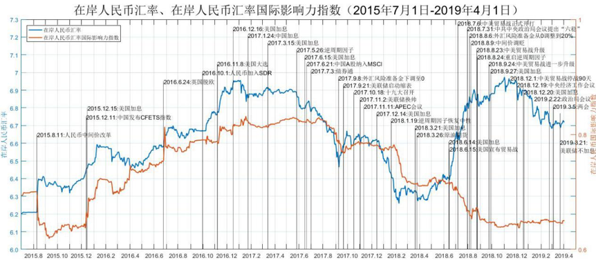

---
authors:
- admin
- 责任编辑：？？。
date: "2019-04-01T00:00:00+08:00"
featured: true
summary: 2018年7月31日召开的中共中央政治局会议，针对经济形势和工作首次提出了“稳就业、稳金融、稳外贸、稳外资、稳投资、稳预期”的“六稳”方针。2018年12月13日和2019年2月22日召开的中共中央政治局会议上，都强调进一步“六稳”提振市场信心。今年《政府工作报告》的核心词也是“六稳”，确保今年经济运行在合理区间。在“六稳”方针下，人民币汇率重拾企稳势头。厦门大学经济学科编制的人民币汇率国际影响力指数显示，人民币汇率的国际影响在2019年第一季度维持基本稳定，稳中有升···
tags:
- 人民币国际影响力指数
- “六稳”方针
title: “六稳”方针下人民币汇率及其国际影响力企稳
---
2018年7月31日召开的中共中央政治局会议，针对经济形势和工作首次提出了“稳就业、稳金融、稳外贸、稳外资、稳投资、稳预期”的“六稳”方针。2018年12月13日和2019年2月22日召开的中共中央政治局会议上，都强调进一步“六稳”提振市场信心。今年《政府工作报告》的核心词也是“六稳”，确保今年经济运行在合理区间。在“六稳”方针下，人民币汇率重拾企稳势头。厦门大学经济学科编制的人民币汇率国际影响力指数显示，人民币汇率的国际影响在2019年第一季度维持基本稳定，稳中有升，如图1示。

图1

一、人民币兑美元汇率呈现明显的升值态势

图2显示2019年年初至今，美元走弱，人民币兑美元汇率呈现出较为明显的升值态势，人民币兑一篮子货币汇率有所上升。那么，导致2019年年初以来人民币兑美元汇率显著升值的原因是什么呢？
 
图2

2018年美国一枝独秀，美联储走在全球主要经济体央行紧缩前列，美元也相应强势，但2019年美国经济下行压力增大，3月21日凌晨，美联储公布3月议息会议声明，美联储继续按兵不动，将联邦基金目标利率区间维持在2.25%-2.50%区间。虽然此次会议不加息与市场预期一致，但此次会议声明较预期更为“鸽派”，从而美联储加息周期已经结束，强美元周期结束，人民币汇率的外部压力得到缓解。图3表明从2019年年初至今，美元指数大致呈现窄幅盘整态势，而并未出现显著下降趋势。因此造成人民币汇率显著升值的原因不是由于美元指数走弱。
 
图3

究其原因，“六稳”方针的推进和落实有利于维持人民币汇率的稳定。“六稳”方针中“稳金融”和“稳预期”包括稳定人民币汇率及其预期。今年以来，“稳金融”和“稳预期”政策效果正逐步显现。2018年汇率政策凸显了“稳”的基调，尤其是在强化逆周期调节方面。从2017年5月底在报价机制中引入逆周期因子，到2018年1月初暂停使用，再到2018年8月底恢复使用，可以发现，逆周期因子都是在人民币有贬值压力时使用、有升值压力时退出，具有阻跌不阻涨的非对称性效果。因此，由于2018年8月底重启逆周期因子后至今尚未取消，从而当美元弱人民币强时，逆周期因子令人民币汇率升的更多。

其次，“稳汇率”政策也体现在中国人民银行决定自2018年8月6日起，将远期售汇业务的外汇风险准备金率从0调整为20%。这是央行针对2018年受贸易摩擦和国际汇市变化等因素影响，外汇市场出现了一些顺周期波动的迹象而采取的措施。人民银行将继续加强外汇市场监测，根据形势发展需要采取有效措施进行逆周期调节，维护外汇市场平稳运行，保持人民币汇率在合理均衡水平上的基本稳定。

“稳预期”包括稳定人民币汇率预期，特别是扭转人民币汇率市场单边贬值预期。如果人民币与美元走势分化加剧，贸易项下和资本项下以投机为目的的资金外流都将加剧，严重影响我国经济稳定性。2019年1月至今，中美经贸高级别磋商持续推进，受此驱动，市场预期正在走出过度悲观的谷底，人民币汇率的稳定基础由此得到增强。

二、人民币汇率国际影响力企稳
图4绘制了从2005年1月3日到2019年4月1日在岸人民币汇率（CNY）国际影响力的走势。图中的五条指数分别是：人民币汇率国际影响力指数（红色）衡量人民币汇率对G20经济体货币汇率的平均净影响力；人民币汇率对发达经济体货币的影响力指数（绿色），衡量CNY对7种发达经济体货币（美元，欧元、英镑、澳元、加元、日元、韩元）的平均净影响力；人民币汇率对发展中国家货币影响力指数（蓝色）衡量了CNY对9种发展中国家货币（阿根廷比索、巴西雷亚尔、印度卢比、印尼卢比、墨西哥元、俄罗斯卢布、沙特里亚尔、南非兰特、土耳其里拉）的平均净影响力；人民币汇率对亚洲国家货币影响力指数（黄色）衡量CNY对G20中五个亚洲国家货币的平均净影响力；人民币汇率对金砖国家货币影响力指数（紫色）衡量了CNY对金砖五国中其它四国货币的平均净影响力。图4显示，自2019年以来，随着“六稳”方针的推进和落实，人民币汇率对G20经济体货币及其不同组合的影响总体均维持基本稳定。
 
图4

展望未来，人民币国际化进程将不断加快，人民币汇率的国际影响有望重拾稳中有升的势头 。2019年1月4日，中国人民银行工作会议提出要稳步推进人民币国际化以服务实体经济、促进贸易投资便利化为导向，进一步完善人民币跨境使用政策。2019年2月，人民币保持国际支付第五大最活跃货币的地位，份额为1.85%。在2019年2月18日公布的《粤港澳大湾区发展规划纲要》中，香港将强化全球离岸人民币业务枢纽的地位，人民币在大湾区的跨境使用规模和范围将会扩大，大湾区内金融产品的跨境交易预计会有快速增长。
同时，外资金融机构进入中国市场会进一步推动人民币资产和人民币的国际化。2018年5月，瑞士银行对瑞银证券实现绝对控股。2018年11月，安联（中国）保险获准筹建，成为我国首家外资保险控股公司，美国运通公司在我国境内发起设立合资公司，筹备银行卡清算机构的申请已经审查通过。2019年1月，美国标普公司获准进入我国信用评级市场。2019年3月，摩根大通获准在中国建立控股证券公司。

“海纳百川，有容乃大”。中国扩大金融开放受到国际市场的普遍肯定和认可，影响力不断提升。2018年6月，我国A股正式纳入MSCI指数，MSCI指数在2019年将加大中国A股占其指数的权重，并将通过三步把中国A股的纳入因子从5%增加至20%。2018年9月，富时罗素宣布将A股纳入其指数体系。2018年，境外投资者投资中国债券市场增加近6000亿元，目前总量达到约1.8万亿元。人民币计价的中国国债和政策性银行债券将从2019年4月起被纳入彭博巴克莱全球综合指数，预计将有1000亿美元流入中国债券市场。2019年3月29日，国际货币基金组织（IMF）发布的数据显示，截至2018年第四季度，人民币资产在各经济体央行持有的外汇储备中占比超过澳元和加元，升至1.89%，创IMF自2016年10月报告人民币储备资产以来最高水平，这反映出2016年底人民币纳入IMF特别提款权货币篮子后，全球外汇储备管理机构降低了对美元的依赖，对持有人民币资产更有兴趣。随着新一轮高水平金融开放的推进，中国资本外流压力将逐步缓解，从而进一步支撑人民币汇率及其国际影响力企稳并重拾上升的势头。

